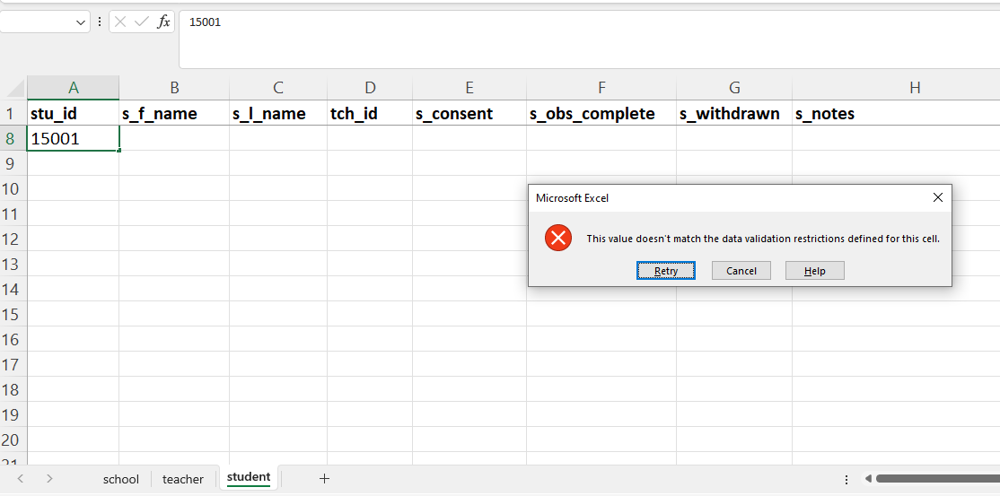
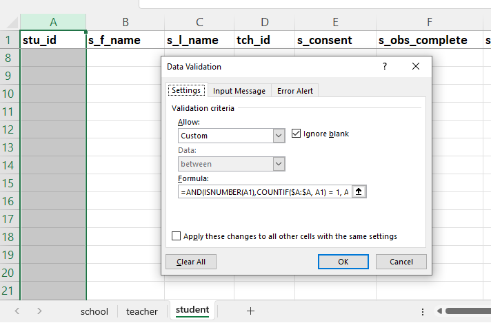
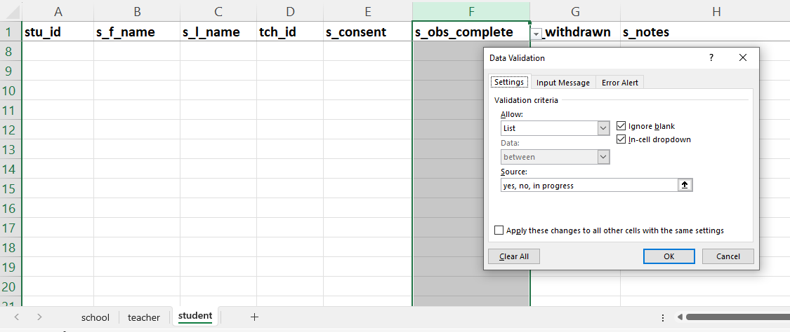
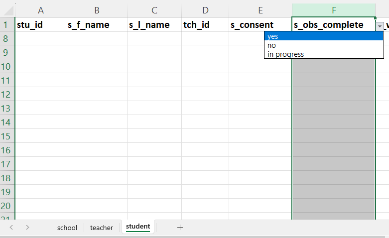
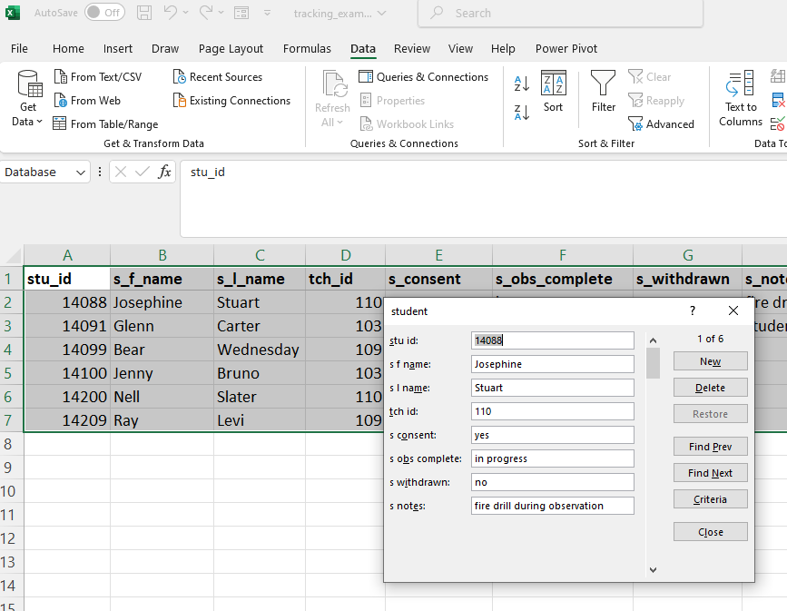
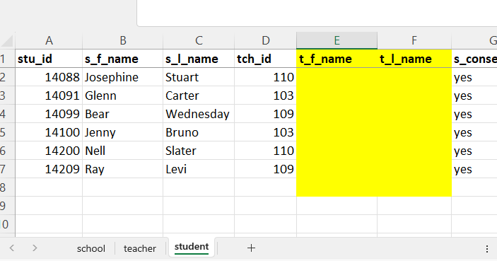
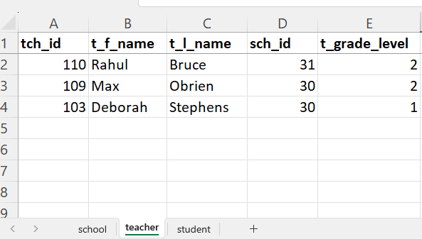
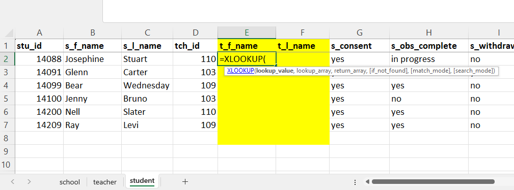
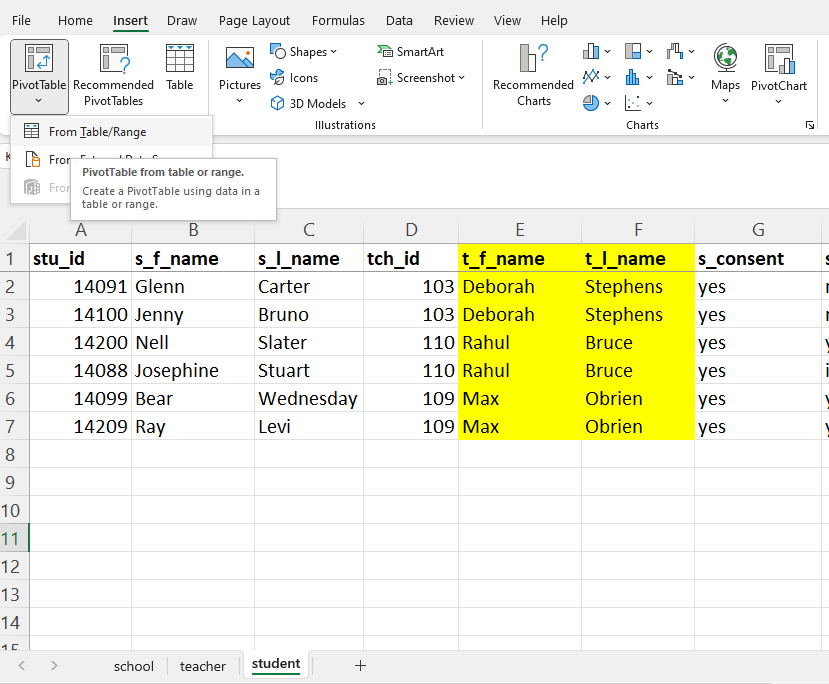
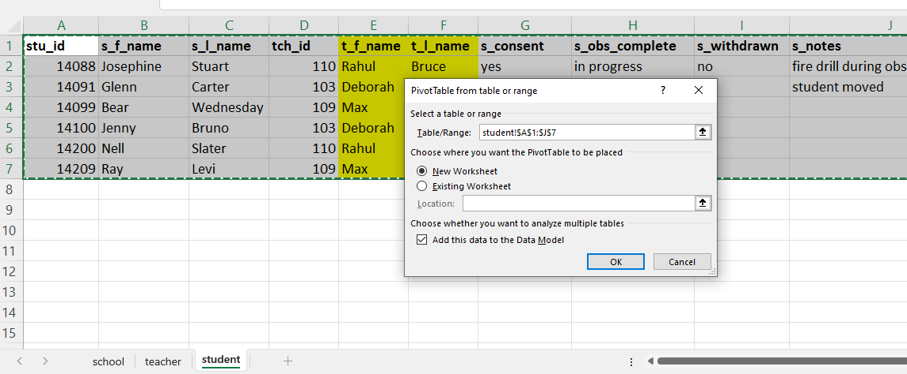

Research projects often involve some form of data entry. Even if you're not collecting paper forms that require your team to [manually enter the responses](https://datamgmtinedresearch.com/capture#capture-paper) (e.g., paper surveys collected in the field need to be manually entered), you're often still entering some sort of [internal record keeping information](https://datamgmtinedresearch.com/track) (e.g., who are our consented participants, what is their contact information, what are their assigned study IDs, what data have we collected on them). There are many reasons that it is typically preferred to enter this information into a database management system (e.g., FileMaker, Microsoft Access, Airtable, LibreOffice Base, Quick Base) as opposed to a spreadsheet, such as Microsoft Excel. While both spreadsheets and databases hold tabular data, there are several benefits to entering data into a database as opposed to a spreadsheet.

1. Data validation is optional in a spreadsheet. This means, within any variable, any type of information can be entered (text, number, dates), all within the same column, reducing the usability and quality of your data. What's even scarier is that Excel often tries to guess what type of data you are entering by applying it's "smart" auto-formatting (e.g., changing your value "3-2" to an unwanted "2-Mar", or converting your leading zero ID "03" to "3"). Whereas in a database, a column type must be chosen when the variable is created and values outside of that type are not allowed to be entered. Choosing further validation (e.g., assigning an allowable range for the variable) is also more intuitive during this origination process.

2. Data entry is more secure in a database. When entering data into a spreadsheet, data can be entered into any cell on the spreadsheet, leading to the potential for errors (e.g., entering data into the wrong cell, writing over existing data). Whereas in a database, data entry is associated with a record (or case) in your data. If there is a not a primary key for a row of data (e.g., a student unique ID), you can't enter data into that row. Furthermore, many database management systems come equipped with the ability to use forms for data entry, allowing users to only enter data for one record at a time.

3. Databases are relational and have powerful querying capabilities. In particular, you can query across tables by linking primary and foreign keys as needed. This removes the need to store redundant information across tables because you can pull that information from linked tables as needed (e.g., pull a teacher name into a student table through a linked teacher ID or create a query using information from multiple tables). Whereas, using spreadsheets, it's a little trickier to query data across sheets.

There are other tools that I've seen people use for data entry that aren't relational databases (meaning they don't allow the flexible linking of information across tables) but they still provide some of the other benefits mentioned. Here is an overview of a few of those tools:

- REDCap - Data entry is done in form view, reducing errors, and data validation can be added when building a form. Querying can be done across forms in the same project (e.g., across all student forms), but querying cannot be done across projects (e.g., linking student forms to teacher forms) without administrative access to more complicated features like APIs. An added benefit of this data entry tool, compared to even a database system, is that you can include value labels for numeric variables (e.g., "no" = 1, "yes" = 2), and you can choose to export data as either the numeric values or the labels. This is very enticing for researchers working with survey data.

- Qualtrics - Data entry is done in form view, reducing errors, and data validation can be added when building a form. No powerful querying can be done across forms (that I'm aware of). Similar to REDCap, this tool also allows you to have both the numeric value and their contextual value labels in a form, and you can choose to export one or the other type of information. This form is best for one time entry, but not great if you need to keep going back and adding/editing information to records over time.

- Google Forms/Sheets - Data entry can be done in form view (using Google Forms) or spreadsheet view (using Google Sheets). There is some limited data validation available in Google forms, and more extensive data validation available if entering directly in Google Sheets. Similar to Qualtrics, using Google Forms is best for one time data entry, but not great if you need to keep editing the data. For the most part, using Google Sheets provides similar functionality as what we will cover in this blog post for Microsoft Excel. The one potential downfall to using Google products over Excel is security. If your data is confidential, Google products may not meet the security requirements you need (talk with your institution to find out).


However, there are times when all of the tools mentioned above might not meet your needs. Maybe you don't have access to some of these tools, maybe the tool doesn't meet your security needs, or maybe your team doesn't have the time or expertise to build in some of these tools. In those cases, often Microsoft Excel is the next best option for entering data. In this blog post I hope to provide some simple ways you can improve the quality of your data, reduce redundancies, and still create helpful queries, without getting too into the weeds of all of the extensions Excel has to offer. These tips include:

1. Adding data validation to improve data quality
2. Using forms to improve data entry security
3. Linking information across sheets to reduce redundancy
4. Using PivotTables to query data

*Note: Before moving forward I think it's important to have a basic understanding of how data should be organized in a spreadsheet, and you can get a brief overview [here](https://datamgmtinedresearch.com/structure#basics-of-a-dataset).*
  
## (1) Adding data validation to improve data quality

Adding data validation to your data entry tool is the number one thing you can do to improve the quality of your data. Here you want to consider things like:

- What are the allowable types of your variables (e.g., numeric, text, date)?
- What are the allowable values or ranges of your variables?
- Are duplicates allowed?

A document like a [data dictionary](https://datamgmtinedresearch.com/document#document-dictionary) is an excellent tool for helping you think through what kinds of validation should be added to each column. 

Let's say you have a simple data entry sheet like we see in Figure 1, where we plan to enter some basic tracking information about the students in our sample. Adding some [simple data validation](https://support.microsoft.com/en-us/office/apply-data-validation-to-cells-29fecbcc-d1b9-42c1-9d76-eff3ce5f7249) is fairly easy to set up in Excel. 

First we select the column we want to apply our rules to.   
Then, we go to "Data" -> "Data Validation" -> "Data Validation".  
Then, we can start applying rules for each variable.   

```{r echo = FALSE, fig.align= "center", fig.cap = "Data validation in Excel"}

knitr::include_graphics("img/validate1.PNG")

```


#### Numeric range

We can restrict the type and range of our variable using data validation. Let's say, for instance, that I know that the column `stu_id`, should only contain values that are numeric and fall within the range of 14000 -- 15000. I can apply those rules to this column.

```{r echo = FALSE, fig.align= "center", fig.cap = "Applying data validation rules to the stu_id column"}

knitr::include_graphics("img/validate2.PNG")

```

Once rules are applied, if someone tries to enter a value outside of that range, or a value that is not numeric, they will get an error. 

```{r echo = FALSE, fig.align= "center", fig.cap = "Getting an error when entering an unacceptable value"}

 

```

However, I also know that the values in the `stu_id` column must be unique. So it would improve my data quality if I go one step further to add that to my data validation. 

While restricting duplicate values is fairly straightforward in many of the database (and some of the other data entry tools) I mentioned earlier, it's a little more involved to add this criteria in Excel. While there are probably several other ways to ensure values are unique, one way is to create custom data validation through a formula. Here I am writing the following formula:

`=AND(ISNUMBER(A1),COUNTIF($A:$A, A1) = 1, A1>=14000, A1<=15000)`

- We ensure that the value entered is numeric (using the `ISNUMBER` formula)
- We ensure the value is unique (using the `COUNTIF` formula where we are only allowing each value to be used once)
- We restrict the range of the values to 14000 -- 15000.

```{r echo = FALSE, fig.align= "center", fig.cap = "Applying custom validation"}



```

#### List of values

We can also apply validation using a list of values. As an example, we can do this for our `s_obs_complete` field.

Here we select "List" as our "Allow" value, and we type our options in the "Source" box, with each option separated by a comma.

```{r echo = FALSE, fig.align= "center", fig.cap = "Applying a validation list of values"}



```

Once you are done, you are left with a drop-down option for this column. This reduces any chances that the word "yes" is inconsistently entered as "YES", or "Yes", or "Y", reducing your ability to categorize information. 

```{r echo = FALSE, fig.align= "center", fig.cap = "A drop-down list of values"}



```

#### Leading zeros

If you have a variable that requires leading zeros, you can also do things to stop Excel from deleting your leading zeros. 

Say for instance, instead of numeric values from 14000 - 15000 our `stu_id` variable ranges from 1 -- 200, and all values must be 3 digits, requiring single and double digits to be padded with leading zeros. Here, we could still add our data validation to ensure entered values are unique, but now we need to change our column type (using the Number Format drop down) to ensure that our zeros don't disappear when they are entered. We can do this by applying custom number formatting.

<center><video src="img/leading_zero.mp4" controls="controls" style="max-width: 730px;">
</video></center>

From here you can apply further data validation using the "Custom" validation and use a function like `LEN` to ensure that a 3 digit value is always entered.

#### Text values

Similarly, if you have a column of text values that you know Excel likes to turn into dates (e.g., "05-02" gets turned into "2-May"), preemptively change that column to "Text" using that same Number Format drop down area to ensure that values remain the values they are entered as.

From here you can apply further data validation using the "Custom" validation to ensure that the format of the input is always "##-##", using functions like `LEN` and/or `COUNTIF`.

#### Specialized validation

Last, one of the really nice things about some of the other data entry tools mentioned earlier, is that a few of them have built in options for validating more specific, but common, other types of values (e.g., emails, phone numbers). Adding validation for those values is typically just a simple point and click in other tools,but the readily available options for Excel are much more limited. However, as we've seen, you can use the "Custom" validation option to build any other types of validation that you might need, including validation for [emails](https://www.lido.app/excel/excel-email-validation), [phone numbers](https://www.tutorialspoint.com/how-to-apply-data-validation-to-force-phone-number-format-in-excel), and so forth. You can probably search for tutorials on most any validation type you can come up with.


### (2) Using forms to improve data entry security

The next thing that can help reduce errors, as well as the chances of writing over or deleting existing data, is using forms in Excel. I don't want you to get too excited because they are not the caliber of forms you might see in many databases or the other tools I mentioned above. The forms available in Excel are not pretty, not customizable, and are very limited (e.g., you can only use them for data entry that includes up to 32 columns/variables, drop-down lists can't be used in forms).

```{r echo = FALSE, fig.align= "center", fig.cap = "Forms in Microsoft Excel"}



```

Adding these forms and using them are really straightforward. You can click through records in a form, add new entries, edit entries, and search entries in the forms. Several excellent tutorials on how to access and set up a form already exist, so rather than rehashing the information I highly recommend reading through this awesome [brief tutorial](https://www.ablebits.com/office-addins-blog/create-data-entry-form-excel/).


### (3) Linking information across sheets to reduce redundancy

One of the biggest pros about building relational databases is that you are able to link data across tables through [primary and foreign keys](https://datamgmtinedresearch.com/structure#structure-link) (see Figure 8 where primary keys are in rectangles and foreign keys are in ovals). This type of functionality is not always necessary for a data entry task, but there are situations where this can be helpful. Relating tables in this way, allows us to pull information across tables, reducing duplication. In Figure 8, you can see that in the "student" tab, we're only entering student information (with exception of `tch_id`). However,  to improve user experience, if I wanted my team to see the teacher first and last name as well while looking at the student tab, not just the `tch_id`, I could simply generate a query to pull that information from the teacher table through the `tch_id` key. This relation removes the need for us to have to type the teacher first and last name over and over for every student in the teacher table, reducing both effort and error.

```{r echo = FALSE, fig.align= "center", fig.cap = "Participant database built using a relational model"}

knitr::include_graphics("img/link1.PNG")

```


While a relational database is built for this type of linking, the [XLOOKUP function](https://support.microsoft.com/en-us/office/xlookup-function-b7fd680e-6d10-43e6-84f9-88eae8bf5929) in Excel can help us emulate this behavior. 

Say for instance, I want to be able to see the teacher name alongside the `tch_id` in our "student" sheet. See our example sheets in Figures 9 and 10.

```{r echo = FALSE, fig.align= "center", fig.cap = "Student tab in Excel"}

 

```

```{r echo = FALSE, fig.align= "center", fig.cap = "Teacher tab in Excel"}



```

Rather than re-entering the teacher name on the "student" tab, I can use `XLOOKUP` to pull this information from the "teacher" tab into the "student" tab.

When we enter `=XLOOKUP()` in to the first cell of our `t_f_name` column, a series of arguments will pop up. The arguments are:

- [lookup_value] (In this case, choose the first `tch_id` value on the "student" tab)
- [lookup_array] (In this case, select all of the `tch_id` values on the "teacher" tab)
- [return_array] (In this case, select the `t_f_name` column on the "teacher" tab)
- There are 3 other optional arguments as well. 
  - [if_not_found] (Default is to return "N/A" if value not found)
  - [match_mode] (Default is to look for an exact match - which we want)
  - [search_mode] (Default is to start searching at the first item which is fine)

```{r echo = FALSE, fig.align= "center", fig.cap = "Using XLOOKUP in Excel"}

 

```

If we fill in the arguments in the first cell as such,

`=XLOOKUP(D2,teacher!A2:A4,teacher!B2:B4)`

We should get the correct value returned from the "teacher" table.

```{r echo = FALSE, fig.align= "center", fig.cap = "Teacher first name returned using XLOOKUP"}

knitr::include_graphics("img/link5.PNG")

```

We can now [copy this formula by dragging it down through the remaining cells](https://support.microsoft.com/en-us/office/copy-a-formula-by-dragging-the-fill-handle-in-excel-for-mac-dd928259-622b-473f-9a33-83aa1a63e218), but first we need to tell Excel which values need to stay consistent, and we can do this using `$`.

`=XLOOKUP(D2,teacher!$A$2:$A$4,school!$B$2:$B$4)`

What is really nice about linking this data is that if a teacher name is changed at any point, when you change it in the "teacher" tab, it will then be updated in the "student" tab as well. Not duplicating information across sheets removes duplication, reduces errors, and saves time. 

**Note:** *Like most of this tutorial, there are many alternatives to what I am showing you. In addition to `XLOOKUP`, You can also use `VLOOKUP` or a combination of `INDEX` and `MATCH`. `XLOOKUP` works best for me but if you want to learn more about either of those alternatives, there are many great posts out there to read. For now, I've linked to a [downloadable Excel Workbook](https://github.com/Cghlewis/crystal_site/blob/main/content/blog/excel_entry/tracking_example_cl.xlsx) where I use all 3 options to pull teacher information into the "student" spreadsheet so you can review the differences and choose which works best for you!*


### (4) Using PivotTables to query data

Another benefit of working with relational databases is that you have tons of flexibility in how you can combine and summarize information across tables. While that full range of flexibility may not be possible in Excel, [PivotTables](https://support.microsoft.com/en-us/office/create-a-pivottable-to-analyze-worksheet-data-a9a84538-bfe9-40a9-a8e9-f99134456576) still provide an excellent way to obtain necessary information for validation and reporting purposes. 

PivotTables allow you to get summary information about individual sheets. Without using extensions such as [Power Pivot](https://support.microsoft.com/en-us/office/power-pivot-overview-and-learning-f9001958-7901-4caa-ad80-028a6d2432ed) (which I've personally never used before), I'm not aware of a simple and easy way to link data across sheets. However, if you need information across different sheets, if you first pull information across sheets using `XLOOKUP` (like we did with teacher name), then that information can be used in our pivot tables.

Once you've linked relevant information across sheets, you can now select a sheet to do a PivotTable on. For our example, we will do a PivotTable on the "student" sheet.

Select "Insert" -> "PivotTable" -> "From Table/Range"


```{r echo = FALSE, fig.align= "center", fig.cap = "Starting a PivotTable"}



```

Select the range of your data and select "New Worksheet".

What's nice about creating PivotTables in other worksheets is that it reduces errors that might happen if you are sorting and filtering directly in your tracking sheets. 

```{r echo = FALSE, fig.align= "center", fig.cap = "Selecting PivotTable options"}



```

One you select "OK", you can begin to build your query. You will first want to drag your primary key (unique identifier) into the "Values" field. Make sure to change the "Value Field Settings" to "Count" rather than "Sum" (see Figure 15). 

```{r echo = FALSE, fig.align= "center", fig.cap = "Changing Value Field Settings"}

knitr::include_graphics("img/pivot3.PNG")

```

From there you can begin dragging other variables of interest to Columns, Rows, or Filters depending on your question. 

For instance, I want to see the status of observation completion per classroom. But I only want to know this for students who have not withdrawn from the study. To get this I could drag `t_l_name` to Columns, `s_obs_complete` to Rows, and `s_withdrawn` to Filters. Then filter to "no" on `s_withdrawn` and I would get something like Figure 16.

```{r echo = FALSE, fig.align= "center", fig.cap = "A pivot table to show the completion of observations by classroom"}

knitr::include_graphics("img/pivot4.PNG") 

```


## Final thoughts

While Excel is not necessarily my data entry tool of choice, it can often be the quickest, easiest, and most readily available option for people who need to get started entering data in a short amount of time. If that is the case for you, hopefully this post has given you some ideas for building this data entry tool in a way that collects higher quality data (with less errors), and in a more efficient and useful way. The tips I've provided are just to help get you started. Full disclosure: **I am not an Excel expert**. Building data entry tools is only a small part of what I do in my work. This blog post is just my attempt to pass along a few quick and simple tips that I've learned along the way that might help researchers who are new to building data entry systems. There are certainly going to be many other ways to improve your data entry system. 

One thing that we did not cover in this post is [double data entry](https://datamgmtinedresearch.com/capture#double-entry). Often it's good practice to double enter your data, especially if you are entering data from paper forms. When it comes to double entry, I don't actually think Excel is at much of a disadvantage compared to other tools, with the exception of REDCap which has an entire module built specifically for double data entry. Otherwise, most tools just allow you to set up your own double data entry system as needed. In Excel, you can either double enter data on two different tabs in the same workbook and then build in formulas in a third sheet that compares values across sheets (e.g., using something like `MATCH`), or you can enter data into into two separate sheets or workbooks and use an external system ([such as a script in a program like R](https://osf.io/saut6)) to compare the two workbooks and report differences.

Finally, if you are someone who has built successful data entry systems in Excel and you have other tips to share, I would love to hear your ideas in the comment section below! 

```{r echo = FALSE, fig.align= "center", out.width="50%"}

knitr::include_graphics("img/excel.jpeg") 

```

Additional articles/tutorials on this topic that I have found helpful:

- [Basic Data Entry Using Excel](https://www.youtube.com/watch?v=Ry2xjTBtNFE&t=145s)
- [Simple Tips for Recording Data in Spreadsheets](https://statsepi.substack.com/p/simple-tips-for-recording-data-in)
- [Tidy Spreadsheetes in Medical Research](https://www.youtube.com/watch?v=9f-hpJbjKZo)
- [Database vs. Spreadsheet: What's the Difference](https://365datascience.com/tutorials/sql-tutorials/database-vs-spreadsheet/)
- [Index Match Formula](https://corporatefinanceinstitute.com/resources/excel/index-match-formula-excel/)
- [VLOOKUP Hack #1: Sort Order](https://www.excel-university.com/vlookup-hack-1-sort-order/)
- [5 Reasons INDEX MATCH Is Better Than VLOOKUP](https://mergeos.com/articles/learn/5-reasons-index-match-is-better-than-vlookup)
