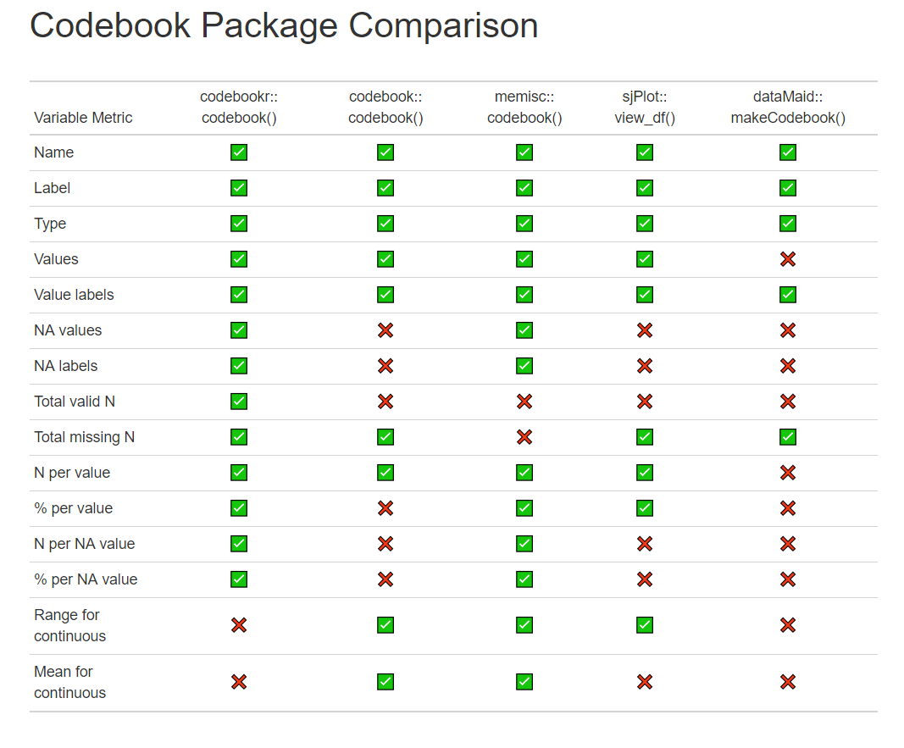

## Codebook Comparison

I started this table as a way to compare existing r packages that assist in codebook creation. The criteria I am looking for include the following variable level metrics (specifically for working with haven::labelled() data):

+ Name
+ Label
+ Type
+ Values (if categorical)
+ Value labels (if categorical)
+ NA values (Missing values: for example -99 and -98)
+ NA labels (Missing value labels: for example -99 = No response, -98 = Unclear response)
+ Total valid N
+ Total missing N
+ N per value (if categorical)
+ % per value (if categorical)
+ N per NA value (Missing value)
+ % per NA value (Missing value)
+ Range (if continuous)
+ Mean (if continuous)

A table of all packages I reviewed can be found here: https://cghlewis.github.io/codebook-pkg-comparison/

Ultimately I have narrowed the table down to these 5 packages. I removed several packages from this final table because they do not work well with haven::labelled() data and/or they do not meet enough of the criteria above.

